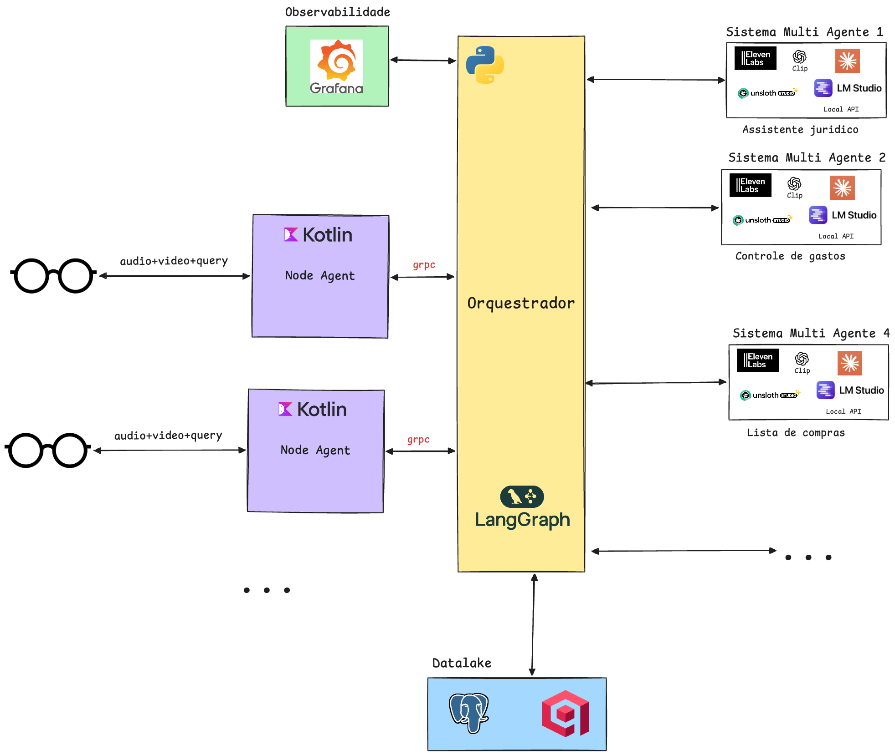
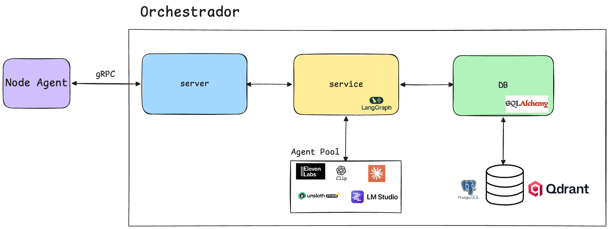

# Metaglass Agent

Plataforma de agentes inteligentes para smart glasses. O sistema recebe inputs multimodais (audio, video, texto) enviados por um middleware e os processa por meio de um orquestrador que roteia as queries para agentes especializados, mantendo contexto de sessao e historico semantico.

## Arquitetura

O projeto e composto por:

- **Orchestrator** — servico gRPC em Python responsavel por gerenciar sessoes, rotear queries para agentes e manter contexto. Utiliza PostgreSQL para estado relacional e Qdrant para busca semantica.
- **Proto** — definicoes protobuf compartilhadas entre os servicos.

## Dentro do Orquestrador

<strong>server</strong>

- Recebe as requisicoes via gRPC.
- Valida a estrutura da requisicao.
- Encaminha para o servico correspondente.

<strong>service</strong>

- Implementa a logica principal do orquestrador.
- Realiza chamadas personalizadas para agentes locais via LangGraph.
- Usa a camada de DB para buscar/persistir contexto.
- Aplica validacoes adicionais para reduzir bugs.

<strong>db</strong>

- Armazena e busca contexto das sessoes de usuario.
- Armazena e busca documentos conforme query e contexto.
- Usa ORM (Object Relational Mapping).

## Documentacao

- [Como rodar o projeto](docs/GETTING_STARTED.md)
- [Como contribuir](docs/CONTRIBUTING.md)
